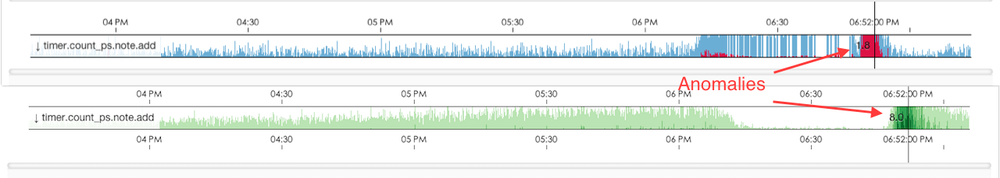

Banshee
=======

Banshee is a real-time anomalies(outliers) detection system for periodic
metrics.

[](https://travis-ci.org/eleme/banshee)
[](https://godoc.org/github.com/eleme/banshee)
[](https://gitter.im/eleme/banshee?utm_source=badge&utm_medium=badge&utm_campaign=pr-badge&utm_content=badge)



Requirements
------------

1. Go >= 1.4 and godep.
2. Node and gulp.

Build
-----

1. Clone the repo.
2. Build binary via `make`.
3. Build static files via `make static`.

Deployment
----------

https://godoc.org/github.com/eleme/banshee#hdr-Deployment

Upgrade
-------

https://godoc.org/github.com/eleme/banshee#hdr-Upgrade

Philosophy
----------

3-sigma:

```python
>>> import numpy as np
>>> x = np.array([40, 52, 63, 44, 54, 43, 67, 54, 49, 45, 48, 54, 57, 43, 58])
>>> mean = np.mean(x)
>>> std = np.std(x)
>>> (80 - mean) / (3 * std)
1.2608052883472445 # anomaly, too big
>>> (20 - mean) / (3 * std)
-1.3842407711224991 # anomaly, too small
```

Documentation
--------------

https://godoc.org/github.com/eleme/banshee

Statsd Backend
--------------

https://www.npmjs.com/package/statsd-banshee

Migrate from bell
-----------------

https://godoc.org/github.com/eleme/banshee#hdr-Migrate_from_bell

Authors
-------

- [@facesea](https://github.com/facesea)
- [@nrzipher](https://github.com/nrzipher)
- [@hit9](https://github.com/hit9)

License
-------

MIT Copyright (c) 2015 - 2016 Eleme, Inc.
